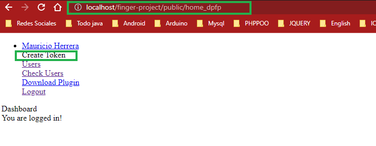

## DPFP 4500 Para Laravel
Lector de huella FP 4500 Digital Persona

[](https://opensource.org/licenses/MIT)
[](https://packagist.org/packages/mhtutorials/dpfp4500)
[](https://packagist.org/packages/mhtutorials/dpfp4500)
<!-- [](https://packagist.org/packages/mhtutorials/dpfp4500)-->


## Video Tutorial
https://www.youtube.com/c/MauricioHerrera0822

## Pre-Requisitos
CRUD de usuarios funcional en tu aplicación laravel.


## Instalación

Para instalar el paquete, ejecuta el siguiente comando en tu terminal:

    composer require mhtutorials/dpfp4500

Una vez instalado, publicar los modelos, controladores, vistas, migraciones, etc.
Para ello ejecuta el siguiente comando en tu terminal:
```php
    php artisan vendor:publish --tag=mhtutorials-dpfp4500-p
```

## Agregar configuración al archivo config/services.php

Copiar la clave "mhdpfp" en el archivo config/services.php de tu aplicación.
En esta configuración se almacenará la clave de api para que el pluguin pueda
conectarse a los servicios de tu proyecto laravel.

NOTA: si tu archivo ya contiene otras claves puedes agregarla al final como una clave mas del array
```php
return [   
 'mhdpfp' => [
            'key' => env('PLUGIN_BIOMETRIC_KEY'),        
     ],
];
```

## Modificar archivo .env

Crear la clave: PLUGIN_BIOMETRIC_KEY en tu archivo .env de la siguiente manera:

```php
PLUGIN_BIOMETRIC_KEY="tu clave aqui"
```

El valor de la clave se genera codificando en base 64 "usuario:contraseña".

Un ejemplo de tu clave api: codifica "tu_usuario:tupass" -> resultado dHVfdXN1YXJpbzp0dXBhc3M=
esta ultima será la clave que debes configurar.

Puedes ir a la pagina: https://www.base64encode.org/, copia tu_usuario:tupass y da click en el botón
"ENCODE", el resultado seria: dHVfdXN1YXJpbzp0dXBhc3M=

NOTA: Esta clave se configurará posteriormente en el plugin biometrico.


## Agregar Rutas api

1. Copia los imports a continuación en tu archivo routes/api.php

    ```php  
    use App\Http\Controllers\DpfpApi\UserRestApiController;
    use App\Http\Controllers\DpfpApi\SseController;
    ```

2. Copia y pega las rutas a continuación en tu archivo routes/api.php

    ```php  
    //SensorRestApi
    Route::get("/sse/{token_pc}", [SseController::class, "stream"]);
    Route::get("/ssejs/{token_pc}", [SseController::class, "streamjs"]);
    Route::post("sensor_close", [SseController::class, "update"])->name("sensor_close");

    //UserRestApi
    Route::post("list_finger", [UserRestApiController::class, "index"]);
    Route::post("save_finger", [UserRestApiController::class, "store"]);
    Route::post("update_finger", [UserRestApiController::class, "update"]);
    Route::post("sincronizar", [UserRestApiController::class, "sincronizar"]);
    ```


## Agregar Rutas web

1. Copia los import a continuación en tu archivo routes/web.php

    ```php  
    use App\Http\Controllers\DpfpApi\UserRestApiController;
    use App\Http\Controllers\DpfpApi\TempFingerprintController;
    ```

2. Copia y pega las rutas a continuación en tu archivo routes/web.php

    ```php 
    // Ruta Home del paquete 
    Route::get('/home_dpfp', function () {
        return view('dpfp_views/home_dpfp');
    });
    //Rutaspara interactuar con el plugin
    Route::get('/users/verify-users', [UserRestApiController::class, 'verify_users'])->name('verify-users');
    Route::get('/users', [UserRestApiController::class, 'users_list'])->name('users_list');
    Route::get("/users/{user}/finger-list", [UserRestApiController::class, "fingerList"])->name("finger-list");
    Route::post('/active_sensor_read', [TempFingerprintController::class, 'store_read']);
    Route::post('/active_sensor_enroll', [TempFingerprintController::class, 'store_enroll']);
    Route::get("/get-finger/{user}", [UserRestApiController::class, "get_finger"])->name("get_finger");
    ```

## Ejecutar las migraciones:

 1. Ejecuta el comando
    ```php  
       php artisan migrate
    ```

2. Modifica los campos 'image' y  'fingerprint' de tipo blob a longblob en la tabla: temp_fingerprint

3. Modifica el campo 'fingerprint' de tipo blob a longblob en la tabla: fingerprints 


## Agrega la relación de huellas al modelo User.php

Copia y pega la relacion a continuación en tu modelo User.php
```php  
//Relacion uno a muchos
public function fingerprints() {
       return $this->hasMany("App\Models\DpfpModels\FingerPrint");
}
```

## Información Importante:

Recuerda publicar el acceso directo a "storage" para que se puedan almacenar las huellas de los usuarios,
para ello ejecuta el comando a continuación:
```php  
php artisan storage:link
```


## Descargar y configurar el plugin biometrico solo para windows

Descarga el instalador del plugin biometrico desde el siguiente enlace:
https://drive.google.com/drive/folders/1U_P6h7sJfjW6INqFMnS3HeJ9DAgnIcdy?usp=share_link

1. Abre el programa plugin biometrico, diligencia los campos en el formulario de configuración

    Url Api: es la url de tu proyecto que apunta hacia las rutas de api, ejemplo:
    http://localhost/tu-projecto/public/api o http://tu-dominio.xx/api

    Para obtener el token ve a la ruta de tu proyecto: home_dpfp y da click en el link "Create Token"

    

    


    Token Pc: es el token que se ha generado desde tu aplicacion web.

    

    
    Usuario y Password: Son las credenciales que codificaste un paso mas arriba, en el apartado 'Modificar archivo .env',
    para este ejemplo son:

    Usuario: tu_usuario

    Password: tupass

    Ahora presiona el botón con el icono de guardar, el plugin se reiniciara automaticamente y si todo ha quedado 
    bien configurado ya puedes comenzar a enrolar y verificar las huellas de tus usuarios.


    Espero que este paquete te ayude en tus proyectos :)

    


